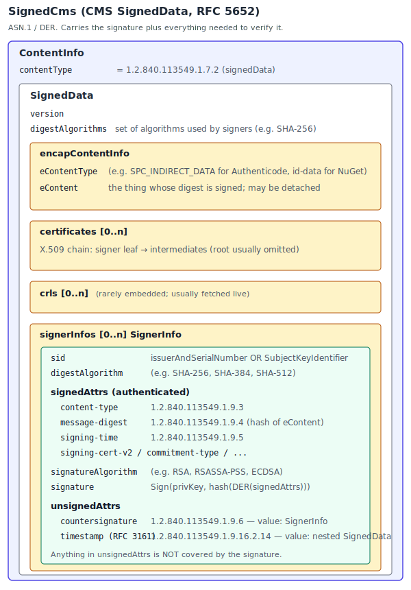
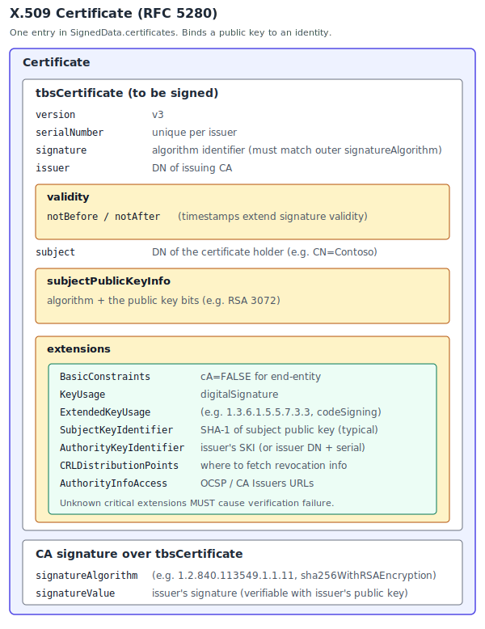

# Sign CLI Primer

A companion to the [dotnet/sign README](https://github.com/dotnet/sign#readme) for engineers maintaining Sign CLI. Read the README first. This document only covers what the README does not: the cryptographic vocabulary you'll see in the code and pointers to authoritative specs.

## Cryptography vocabulary

- **Digest (hash)**: fixed-size fingerprint produced by a cryptographic hash algorithm (e.g. SHA-256). Spec: [NIST FIPS 180-4](https://csrc.nist.gov/publications/detail/fips/180/4/final).
- **ASN.1 / DER**: schema (ASN.1) and deterministic byte encoding (DER) underneath certificates and signed messages. Inspect with `certutil -asn -v`. Spec: [ITU-T X.690](https://www.itu.int/rec/T-REC-X.690).
- **OID (Object Identifier)**: dotted-number ASN.1 identifier for algorithms, certificate extensions, key usages, and signed attributes (for example `2.16.840.1.101.3.4.2.1` is SHA-256). Look up either direction with `certutil -oid <oid-or-name>`.
- **X.509 certificate**: public key plus identity metadata, issued by a CA. Primer: [RFC 5280](https://datatracker.ietf.org/doc/html/rfc5280).
- **CA (Certificate Authority)**: an entity that issues X.509 certificates. A root CA is self-signed and explicitly trusted by the operating system's trust store. An intermediate CA is issued by a root (or another intermediate) and issues end-entity certificates. Code-signing certificates are end-entity certificates.
- **Certificate chain**: an ordered sequence of certificates from the end-entity (leaf) through zero or more intermediates up to a trusted root. Verifiers build the chain to confirm the leaf's issuer is trusted. CMS `SignedData` typically embeds the chain (minus the root) so verifiers can build it without fetching certificates separately.
- **Revocation (CRL / OCSP)**: mechanisms for a CA to declare a certificate invalid before its `notAfter` date. A CRL (Certificate Revocation List) is a signed list of revoked serial numbers, fetched from a URL in the certificate's `CRLDistributionPoints` extension. OCSP (Online Certificate Status Protocol) provides real-time single-certificate status checks via the `AuthorityInfoAccess` extension. Specs: [RFC 5280 §5](https://datatracker.ietf.org/doc/html/rfc5280#section-5) (CRL), [RFC 6960](https://datatracker.ietf.org/doc/html/rfc6960) (OCSP).
- **EKU (Extended Key Usage)**: X.509 extension constraining certificate use. Code signing is `1.3.6.1.5.5.7.3.3`. Microsoft tooling calls the same extension *Enhanced Key Usage*. Reference: [RFC 5280 §4.2.1.12](https://datatracker.ietf.org/doc/html/rfc5280#section-4.2.1.12).
- **RSA**: an asymmetric signature algorithm. The holder of the private key signs a digest; anyone with the matching public key (in an X.509 certificate) can verify. Common code-signing key sizes are 3072 and 4096 bits. Sign CLI uses PKCS #1 v1.5 padding. RSASSA-PSS, the other scheme defined by RFC 8017, is not used. Spec: [RFC 8017 (PKCS #1 v2.2)](https://datatracker.ietf.org/doc/html/rfc8017).
- **PKCS #12 / PFX**: a `.pfx` file bundling a certificate (and its chain) with its private key, usually password-protected. Spec: [RFC 7292](https://datatracker.ietf.org/doc/html/rfc7292).
- **HSM (Hardware Security Module)**: tamper-resistant hardware that signs without exposing the key. Cloud HSMs (Key Vault Premium, Trusted Signing) and local HSMs (smart cards, USB tokens via CNG) both satisfy the [CA/Browser Forum Code Signing Baseline Requirements](https://cabforum.org/working-groups/code-signing/documents/), which now mandate HSM-backed keys for publicly trusted code-signing certificates.
- **Digest signing**: a signing approach where the caller pre-computes the content's digest and asks the signer to sign that digest (rather than handing over the content). Sign CLI uses this pattern uniformly: every cryptographic signer calls `RSA.SignHash` on the `RSA` returned by `ISignatureAlgorithmProvider.GetRsaAsync`, never `SignData`. For cloud providers (Key Vault, Trusted Signing) this also keeps file contents off the wire. For the local `certificate-store` provider and PFX files the private key is in process, so the property is purely architectural.
- **CMS / PKCS #7**: ASN.1 envelope for "signed data" (content, signer info, certs, signed attributes). NuGet, Authenticode (PE, MSI, CAB, CAT, AppX/MSIX, PowerShell scripts, JScript/VBScript), and RFC 3161 timestamp tokens are CMS variants. (VSIX and ClickOnce use XML Digital Signatures instead, not CMS.) Spec: [RFC 5652](https://datatracker.ietf.org/doc/html/rfc5652). .NET API: [`SignedCms`](https://learn.microsoft.com/dotnet/api/system.security.cryptography.pkcs.signedcms).
- **Authenticode**: Microsoft's signing format for PE, MSI, CAB, CAT, AppX/MSIX, PowerShell scripts, and JScript/VBScript. CMS wraps an `SpcIndirectDataContent` blob (digest plus file-type OID). For PE, the blob lives in the PE certificate table; for MSI, in the `\x05DigitalSignature` OLE compound-document stream. Spec: [Windows Authenticode PE Signature Format](http://download.microsoft.com/download/9/c/5/9c5b2167-8017-4bae-9fde-d599bac8184a/Authenticode_PE.docx).
- **Timestamping (RFC 3161)**: a TSA signs a hash of the signature value, producing a timestamp token that preserves validity past certificate expiry. Specs: [RFC 3161](https://datatracker.ietf.org/doc/html/rfc3161) and [RFC 5816](https://datatracker.ietf.org/doc/html/rfc5816) (`ESSCertIDv2` update).
- **OPC (Open Packaging Conventions)**: ZIP-based container used by VSIX, Office, XPS. Signature parts live under `/package/services/digital-signature/`. Spec: [ECMA-376 Part 2](https://www.ecma-international.org/publications-and-standards/standards/ecma-376/) (also published as [ISO/IEC 29500-2](https://www.iso.org/standard/77818.html)).
- **NuGet package signatures**: CMS signature stored as `.signature.p7s` inside the `.nupkg`. Author signatures and repository countersignatures can co-exist. Spec: [NuGet package signatures](https://learn.microsoft.com/nuget/reference/signed-packages-reference).
- **ClickOnce manifests**: XML files (`.application`, `.vsto`, `.manifest`) signed using [XML Signature](https://www.w3.org/TR/xmldsig-core/). The deployment manifest references the application manifest's digest, so the application manifest must be signed first. The legacy `Mage` and `MageUI` tools were the historical signers.

## Structure at a glance

## Signature formats by file type

Every format below ultimately wraps a CMS `SignedData` (or, for VSIX and ClickOnce, an XML Signature) around a digest of the payload. What differs is where the signature lives and what `eContent` the digest is taken over.

- **Authenticode (PE, MSI, CAB, CAT, AppX/MSIX, PowerShell, JScript, VBScript)**: CMS `SignedData` whose `eContent` is an `SpcIndirectDataContent` ASN.1 blob (file-type OID plus payload digest). For PE, the CMS blob is stored in the certificate table (data directory index `IMAGE_DIRECTORY_ENTRY_SECURITY` in the PE optional header). For MSI (an OLE compound document), it's stored in the `\x05DigitalSignature` stream. For scripts, it's embedded as a base64 block inside a comment-delimited trailer: `# SIG # Begin signature block` for PowerShell, `'** SIG **` for VBScript, `//** SIG **` for JScript. JScript and VBScript signing uses COM and requires an STA thread.
- **NuGet (`.nupkg`)**: CMS `SignedData` written as the `.signature.p7s` zip entry at the root of the package. `eContent` is a UTF-8 properties document (custom key-value format) carrying a Base64-encoded hash of the unsigned package bytes. Repository countersignatures attach as an unsigned attribute on the author signer.
- **VSIX and other OPC packages**: XML Signature parts under `/package/services/digital-signature/` inside the zip (`origin.psdor`, `xml-signature/<id>.psdsxs`, plus a DER-encoded `.cer` certificate part). Each referenced part has its own digest; the manifest is what's signed.
- **ClickOnce (`.application`, `.vsto`, `*.manifest`)**: XML Signature ([XMLDSig](https://www.w3.org/TR/xmldsig-core/)) embedded in the XML manifest. The deployment manifest references the application manifest's digest, so inner manifests must be signed first.
- **RFC 3161 timestamp tokens**: a nested CMS `SignedData` (`eContent` = `TSTInfo`) attached as an unsigned attribute on the outer signer. Verifiers use the timestamp's `TSTInfo.genTime` to evaluate the signing certificate's validity, so a signature outlives its certificate.

## Verification commands

Useful while debugging signatures Sign CLI produces.

- PE / MSI: `signtool verify /pa /v <file>` or PowerShell `Get-AuthenticodeSignature <file> | Format-List *`.
- NuGet: `nuget verify -All <pkg>` or `dotnet nuget verify <pkg>`.
- VSIX / OPC: [`vsixsigntool`](https://www.nuget.org/packages/Microsoft.VSSDK.VsixSignTool) `verify /v <file>` or unzip and inspect `/package/services/digital-signature/`. Note: `vsixsigntool` is separate from the OPC signing code vendored under `src/Sign.Core/Tools/VsixSignTool/`.
- Any CMS blob: `certutil -asn -v <file>`.
- Any certificate: `certutil -dump <cert>`.
